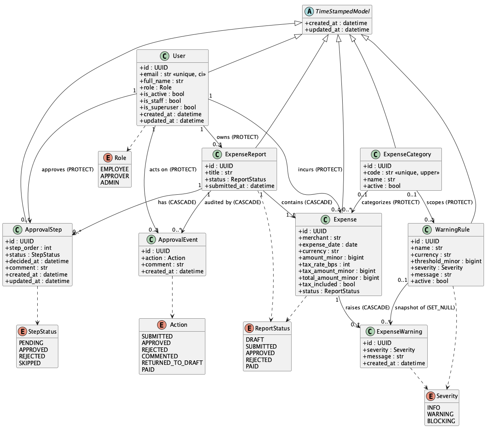
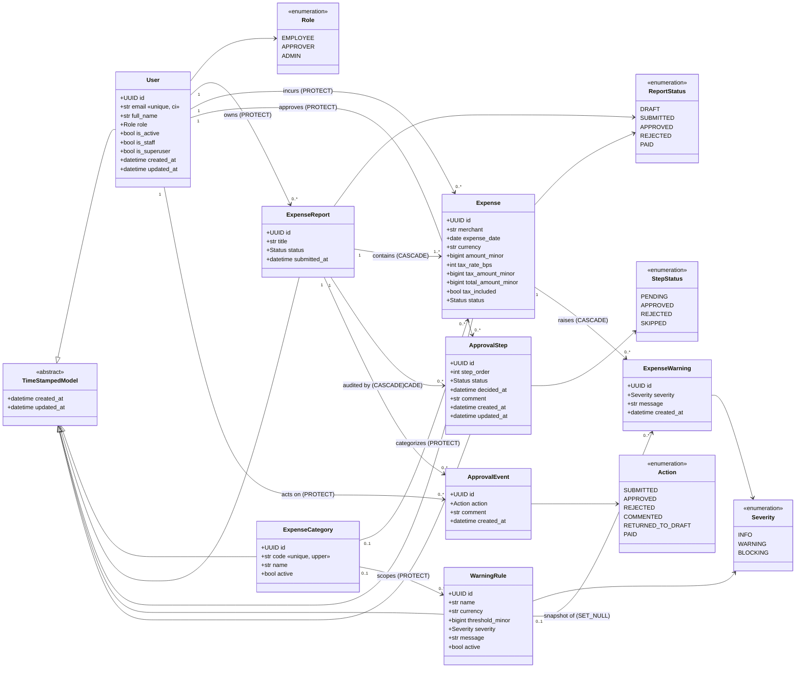
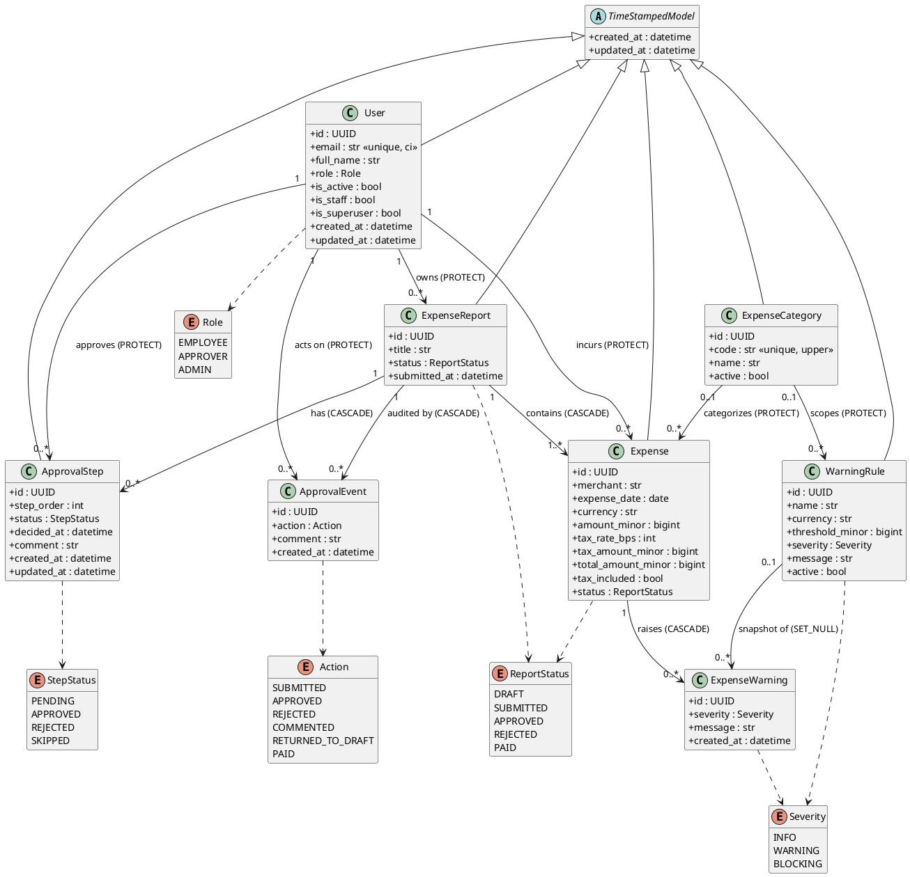

# Data model

UML class diagram of the persistence layer: entities, `TextChoices` enums, inheritance, and
foreign-key relationships. Each association is annotated with its cardinality and the `on_delete`
behavior configured on the foreign key.

- `CASCADE` — children are removed with their parent (report → expenses, report → approval rows,
  expense → warnings).
- `PROTECT` — the referenced row cannot be deleted while it is still referenced (users, categories).
- `SET_NULL` — deleting a `WarningRule` keeps the historical `ExpenseWarning` snapshot, nulling the
  link.

All core entities extend the abstract `TimeStampedModel` (`created_at` / `updated_at`). `User` also
extends Django's `AbstractBaseUser` + `PermissionsMixin`. `ExpenseWarning` and `ApprovalEvent` are
immutable audit rows and only carry `created_at`, so they do not inherit `TimeStampedModel`.



## Mermaid



## PlantUML

The source also lives in [`data-model.puml`](data-model.puml). Render it with:

```bash
java -jar plantuml.jar -tpng backend/docs/data-model.puml
```


